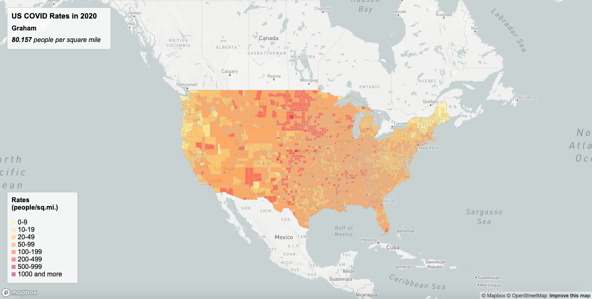
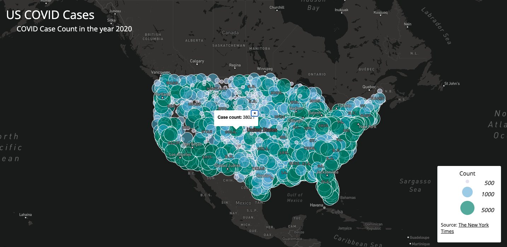

# US COVID Data in 2020

## Context

This project build two thematic map that illustrate US COVID rates and case count in 2020, respectively. The data was collected regarding cases was collected in 2020 by the [New York Times](https://github.com/nytimes/covid-19-data/blob/43d32dde2f87bd4dafbb7d23f5d9e878124018b8/live/us-counties.csv). The cases correspond to population utilizing the population data gathered by the United States Census in 2018 as part of their 5 year estimates. Cases illustrated on the maps are on county level and are calculated as cases per thousand residents.

## Map 1: US COVID Rates in 2020

A choropleth map that displays the rate of covid cases at a county level in the United States.

*link*

## Map 2: US COVID Cases in 2020

A proportional map that displays the case count of COVID cases at a county level in the United States.

*link*